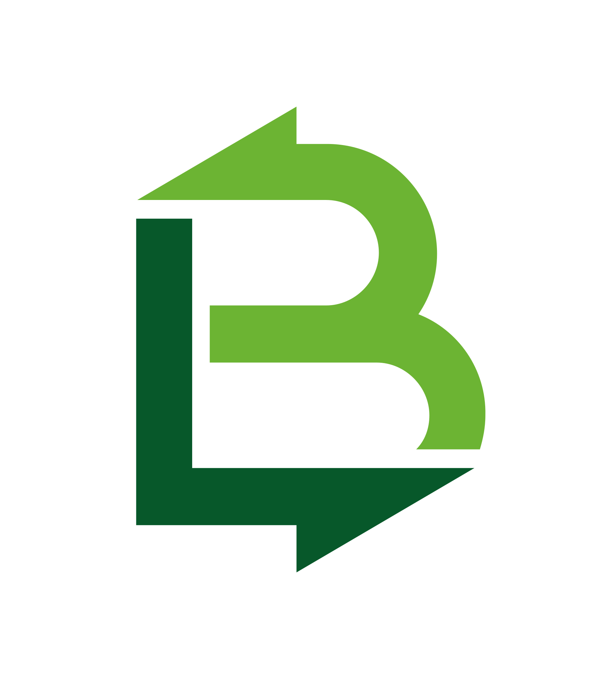
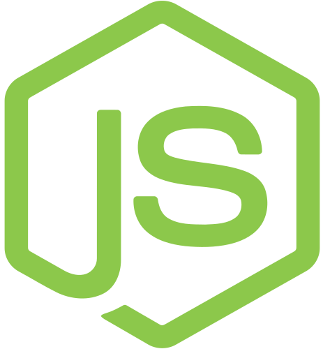

<p align="center">
    <h1 align="center">RESTful API</h1>
    <p align="center" style="font-size: 1.2rem;">The Restful API used for the SAFE PLANT analytics portal</p>
    <p align="center" style="font-size: 1rem; color: red">Built with LOOPBACK FRAMEWORK</p>
</p>

This project was developed on top of the [LoopBack](http://loopback.io) framework and uses a [MongoDB](https://www.mongodb.com/") database hosted on [MLab](https://mlab.com/).

# Quick start

> The generated project have dependencies that require `node` together with `npm`.

**Make sure you have Node version >= 8.0 and (NPM >= 5 or [Yarn](https://yarnpkg.com) )**

```bash
# clone the repository
git clone https://github.com/brionmario/restful-api.git

# change the directory
cd restful-api

# install the dependencies with npm
npm install

# start the development server
npm start

```

# Built With

<a href="https://loopback.io/"></a>&nbsp;&nbsp;
<a href="https://nodejs.org/en/"></a>&nbsp;&nbsp;
<a href="https://expressjs.com/"></a>&nbsp;&nbsp;
<a href="https://www.mongodb.com/"></a>&nbsp;&nbsp;
<a href="https://mlab.com/"></a>&nbsp;&nbsp;

# License

This project is licensed under the MIT License - see the [LICENSE.md](LICENSE.md) file for details.
